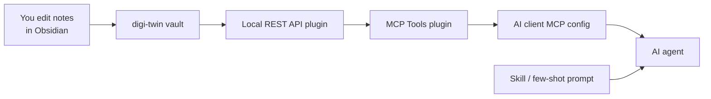

# Obsidian MCP Setup

Connect **any MCP-capable AI client** (Cursor, Claude Code, etc.) to this vault so agents pull context automatically when developing in any other repo — no per-project `CLAUDE.md` files.

This setup is for **Mike's digi-twin vault**, but the same Obsidian + MCP bridge works for anyone who forks the layout.

## Architecture



| Piece | Role |
|-------|------|
| **digi-twin vault** (Obsidian) | Knowledge base you edit |
| **Local REST API** plugin | Authenticated HTTP API to the open vault |
| **MCP Tools** plugin | MCP server binary + semantic search |
| **AI client MCP config** | Cursor `~/.cursor/mcp.json`, Claude Code user/project MCP settings, etc. |
| **Digital twin skill / prompt** | Policy: what to load, stack detection, behavioral rules |

**Critical habit:** keep the **digi-twin** vault open in Obsidian while coding elsewhere. MCP queries whichever vault Obsidian currently has open.

## One-time install

From the repo root:

```bash
chmod +x scripts/setup-obsidian-mcp.sh
./scripts/setup-obsidian-mcp.sh
```

Then in Obsidian (digi-twin vault):

1. **Settings → Community plugins** — enable **Local REST API** and **MCP Tools**
2. **Local REST API** — generate or copy the API key
3. Add the MCP server to your AI client (see below)

Server command:

```text
/Users/michaelweaver/Websites/digi-twin/.obsidian/plugins/mcp-tools/bin/mcp-server
```

Set `OBSIDIAN_API_KEY` to your Local REST API key.

### Cursor

Merge [.cursor/mcp.json.example](../.cursor/mcp.json.example) into `~/.cursor/mcp.json`. Restart **Settings → MCP → obsidian-mcp-tools** until status is green.

Copy the skill:

```bash
mkdir -p ~/.cursor/skills/mike-digital-twin
cp skills/mike-digital-twin/SKILL.md ~/.cursor/skills/mike-digital-twin/
```

### Claude Code

Add the same MCP server entry to your Claude Code MCP configuration (user or project scope) with the same `command` and `OBSIDIAN_API_KEY`.

Point Claude at `skills/mike-digital-twin/SKILL.md`, or paste the few-shot prompt from [[How to Use the Digital Twin#Adapting for someone else]].

### Other clients

Any MCP client that supports stdio servers can use the same binary and env vars.

## Verify

In any project (not necessarily digi-twin), ask the agent:

> Use Obsidian MCP: run get_server_info, then search_vault_smart for "AI Behavior" in Preferences.

Expected: MCP responds with vault content from this repo.

## Agent workflow (automatic)

When the digital twin policy activates on non-trivial dev work:

1. `get_server_info` — confirm MCP is up
2. `search_vault_smart` — find relevant prefs/stacks/patterns
3. `get_vault_file` — load matched notes (e.g. `Stacks/Bun Monolith.md`)
4. Read open project's `package.json` for stack detection
5. Read project `.prettierrc` / `tsconfig.json` (project config wins)

**Fallback:** if MCP is down, read files from `/Users/michaelweaver/Websites/digi-twin/`.

## MCP tools used most

| Tool | Use |
|------|-----|
| `get_server_info` | Health check |
| `search_vault_smart` | Semantic search with folder filters |
| `get_vault_file` | Load a specific note |
| `list_vault_files` | Browse `Stacks/`, `Preferences/` |

## Troubleshooting

| Symptom | Fix |
|---------|-----|
| MCP errored in AI client | Obsidian not running, or wrong vault open, or plugins disabled |
| Wrong content returned | Open **digi-twin** in Obsidian, not another vault |
| `command` not found | Re-run `./scripts/setup-obsidian-mcp.sh` |
| 401 / auth errors | Regenerate API key in Local REST API; update MCP config |

## Related

- [[How to Use the Digital Twin]]
- [[README]]
- [[Preferences/AI Behavior]]
