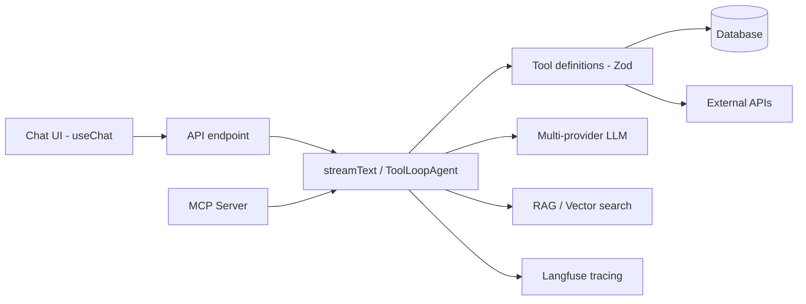

# AI Agent Stack

Cross-cutting AI architecture map. **Conventions live in [[Stacks/AI Agent App]]** (canonical: tool definitions, prompt management, human-in-the-loop, RAG, Langfuse). This note only maps the architecture and which pattern each runtime uses.

## Architecture overview



## Core dependencies

```json
{
  "ai": "^6.x",
  "@ai-sdk/react": "^3.x",
  "@ai-sdk/openai": "...",
  "@ai-sdk/anthropic": "..."
}
```

## Pattern by runtime

| Pattern | Stack | Usage |
|---------|-------|-------|
| `ToolLoopAgent` | Bun Monolith | Multi-step agent with expert/model selection |
| `streamText` + tools | Express / Vue Serverless | Streaming chat with tool calling |
| `useChat` | All chat UIs | Frontend streaming state |
| MCP server | Any agent app | External agent access via `/mcp` |

## Related

- [[Stacks/AI Agent App]] — canonical conventions (tools, Langfuse, HITL, prompts)
- [[Preferences/AI Development]]
- [[Preferences/AI Behavior]]
