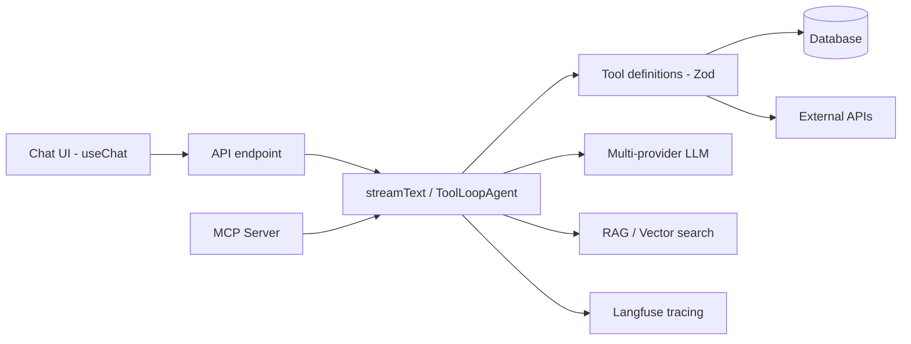

# AI Agent Stack

Cross-cutting AI architecture. For stack-specific application, see [[Stacks/AI Agent App]].

## Architecture overview



## Core dependencies

```json
{
  "ai": "^6.x",
  "@ai-sdk/react": "^3.x",
  "@ai-sdk/openai": "...",
  "@ai-sdk/anthropic": "..."
}
```

## Agent patterns

| Pattern | Stack | Usage |
|---------|-------|-------|
| `ToolLoopAgent` | Bun Monolith | Multi-step agent with expert/model selection |
| `streamText` + tools | Express / Vue Serverless | Streaming chat with tool calling |
| `useChat` | All chat UIs | Frontend streaming state |
| MCP server | Any agent app | External agent access via `/mcp` |

## Tool definition pattern

```typescript
import { tool } from 'ai';
import { z } from 'zod';

export const searchKnowledge = tool({
  description: 'Search the knowledge base',
  inputSchema: z.object({ query: z.string() }), // v5+ renamed `parameters` → `inputSchema`
  execute: async ({ query }) => { /* ... */ },
});
```

Factory pattern: `createTools(userId)` returns context-aware tool sets.

## Langfuse integration

- Prompts versioned in repo, synced via CLI scripts
- Tracing wraps chat requests (`withTrace`, OpenTelemetry)

## Human-in-the-loop

External-write tools use `needsApproval: true`.

## Related

- [[Stacks/AI Agent App]]
- [[Preferences/AI Development]]
- [[Preferences/AI Behavior]]
