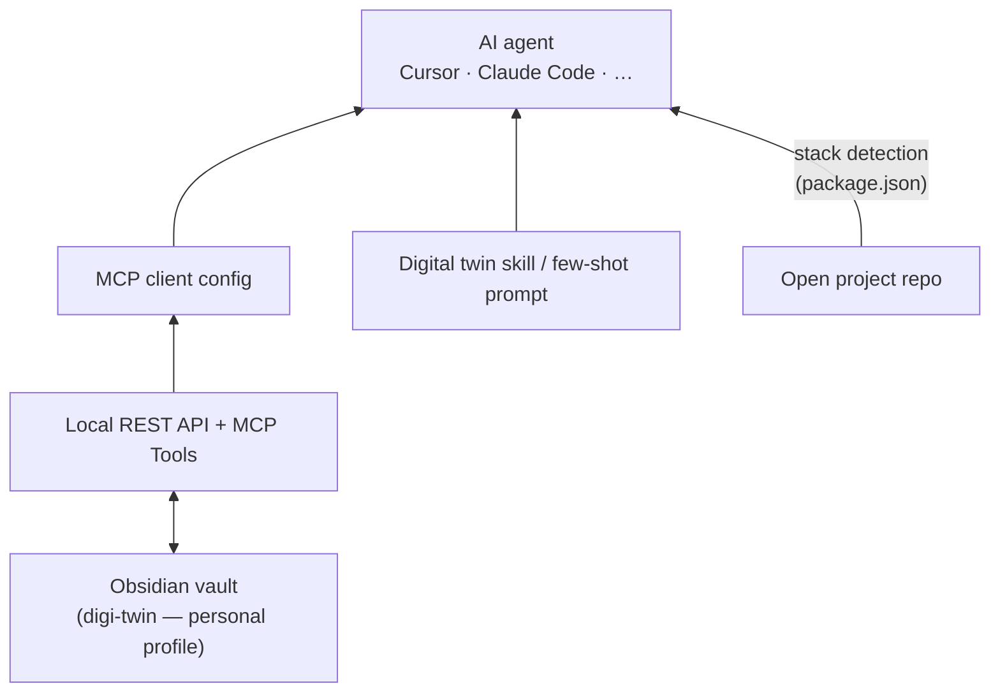

# digi-twin

**Mike Weaver's personal digital twin** — a portable knowledge vault for AI-assisted development: who I am, how I code, how AI should behave, and conventions by tech stack.

It is built for me, but the pattern is generic. Fork the structure, swap in your own `Context/` and `Preferences/`, and teach any agent your profile with a few-shot prompt or a copied skill file — no per-repo `CLAUDE.md` or editor-specific rules required.

Works with **Cursor**, **Claude Code**, and any MCP-capable AI client.

**Getting started:** [How to Use the Digital Twin](Notes/How%20to%20Use%20the%20Digital%20Twin.md)  
**MCP setup:** [Obsidian MCP Setup](Notes/Obsidian%20MCP%20Setup.md)

## How context reaches your AI agent



Keep **digi-twin** open in Obsidian while coding in other repos. The agent fetches notes via MCP; the skill (or a short prompt) defines what to load and how to detect stack from the open project.

## Adapting this for yourself

1. **Clone the folder layout** — `Context/`, `Preferences/`, `Stacks/`, `Patterns/`
2. **Replace personal content** — start with `Context/About Me.md` and the preference notes
3. **Wire up MCP** — same Obsidian plugins; point your client's MCP config at the vault server (see [Obsidian MCP Setup](Notes/Obsidian%20MCP%20Setup.md))
4. **Give the agent a policy** — copy and rename `skills/mike-digital-twin/SKILL.md`, or paste a few-shot prompt at session start:

   > Follow my digital twin vault. Before non-trivial work, search Preferences and Stacks via MCP, detect stack from the open project's package.json, and match project-local config over stack defaults.

5. **Iterate from real sessions** — when the agent gets something wrong, patch the matching note instead of repeating the correction

## Folder guide

| Folder | Purpose |
|--------|---------|
| [Context/](Context/) | Bio, career, skills |
| [Preferences/](Preferences/) | Coding preferences and AI behavior |
| [Stacks/](Stacks/) | Conventions by tech stack (detected at runtime) |
| [Patterns/](Patterns/) | Cross-cutting architectural patterns |
| [Notes/](Notes/) | Guides and operational notes |
| [Karpathy/](Karpathy/) | AI behavioral reference ([upstream source](https://github.com/forrestchang/andrej-karpathy-skills)) |
| [.cursor/](.cursor/) | Optional Cursor rules and MCP config example |
| [scripts/](scripts/) | Vault setup scripts |
| [skills/](skills/) | Agent policy template (copy into your client's skill/prompt location) |

## Context stack

1. **How AI should behave** — [Preferences/AI Behavior](Preferences/AI%20Behavior.md), [Code Review with AI](Preferences/Code%20Review%20with%20AI.md), backed by [Karpathy/CLAUDE](Karpathy/CLAUDE.md)
2. **How I code** — `Preferences/*`, `Patterns/*` (via Obsidian MCP)
3. **What shape this project is** — detect stack from the open project's `package.json` → load `Stacks/<profile>.md`

## Stack detection

No repo catalog. When working in a project, AI reads `package.json` and matches against [Stacks/Index](Stacks/Index.md). If `@ai-sdk/*` is present, also load [Stacks/AI Agent App](Stacks/AI%20Agent%20App.md).

Project-local config (`.prettierrc`, `tsconfig.json`) always wins over stack defaults.

## Setup

```bash
git clone <your-repo-url> ~/Websites/digi-twin
cd ~/Websites/digi-twin

# Obsidian plugins + MCP server binary
./scripts/setup-obsidian-mcp.sh
```

Then:

1. Open the vault in [Obsidian](https://obsidian.md), enable **Local REST API** and **MCP Tools**
2. Add the MCP server to your AI client (see [Obsidian MCP Setup](Notes/Obsidian%20MCP%20Setup.md))
3. Copy `skills/mike-digital-twin/SKILL.md` into your client's skill or prompt location — or use a few-shot prompt instead

`.obsidian/` is gitignored (local plugins and workspace state).

## AI client integration

| Client | MCP config | Policy (skill / prompt) |
|--------|------------|-------------------------|
| **Cursor** | `~/.cursor/mcp.json` — see [.cursor/mcp.json.example](.cursor/mcp.json.example) | `~/.cursor/skills/mike-digital-twin/SKILL.md` |
| **Claude Code** | Project or user MCP settings — same server command and API key | Point at `skills/mike-digital-twin/SKILL.md` or paste a few-shot prompt |
| **Other MCP clients** | Equivalent MCP server entry | Same skill file or prompt text |

Optional Cursor-only extras in `.cursor/rules/` — pointers to vault sources when editing this repo directly.

## Credits

Behavioral guidelines adapted from [andrej-karpathy-skills](https://github.com/forrestchang/andrej-karpathy-skills) by Forrest Chang, derived from [Andrej Karpathy's observations](https://x.com/karpathy/status/2015883857489522876) on LLM coding pitfalls.
